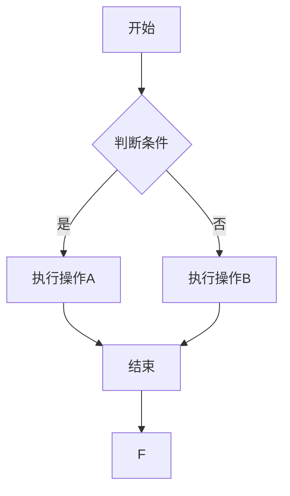
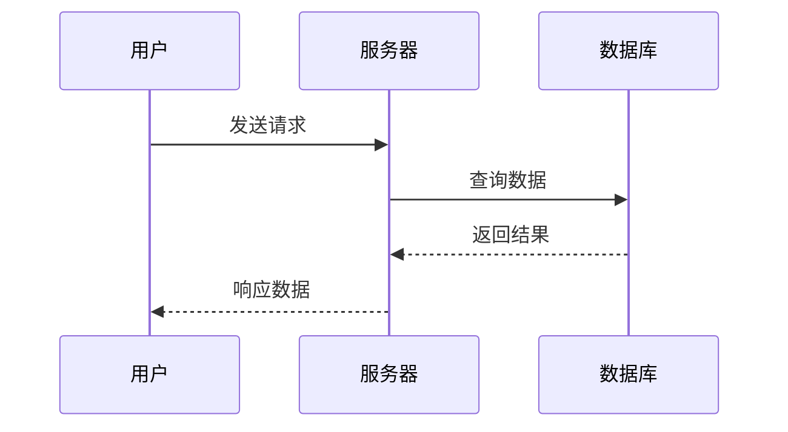
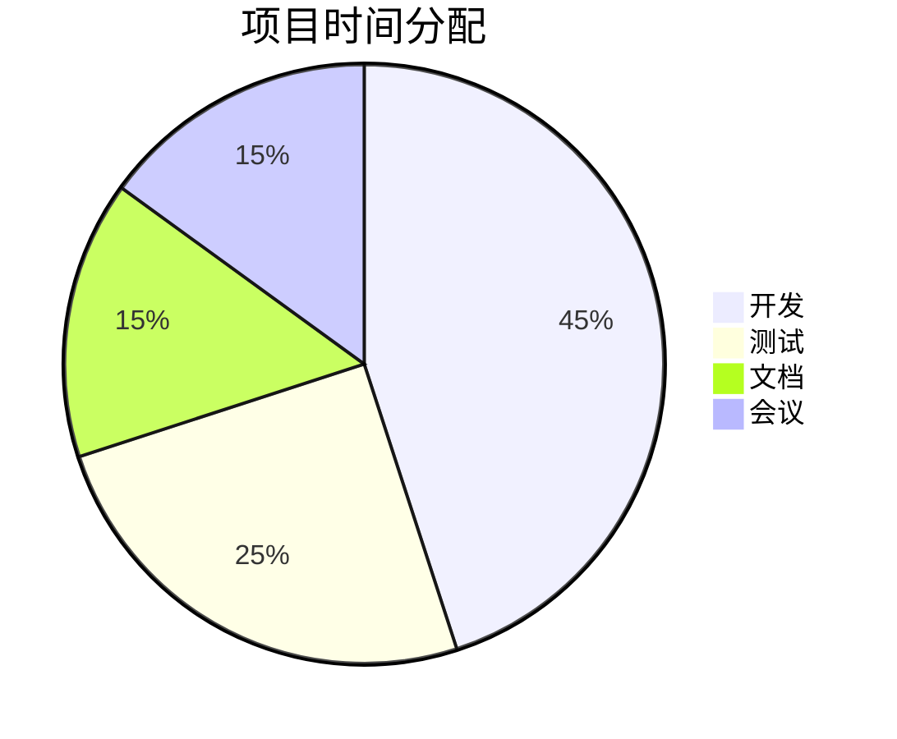

# Mermaid 图表测试

## 流程图


```mermaid
graph TD
    A[开始] --> B{判断条件}
    B -->|是| C[执行操作A]
    B -->|否| D[执行操作B]
    C --> E[结束]
    D --> E --> F
```

## 时序图


```mermaid
sequenceDiagram
    participant 用户
    participant 服务器
    participant 数据库
    用户->>服务器: 发送请求
    服务器->>数据库: 查询数据
    数据库-->>服务器: 返回结果
    服务器-->>用户: 响应数据
```

## 饼图


```mermaid
pie title 项目时间分配
    "开发" : 45
    "测试" : 25
    "文档" : 15
    "会议" : 15
```

## 普通代码块（不应被渲染）

```javascript
console.log('这是普通代码块，不是 mermaid')
```
